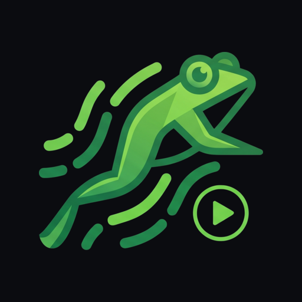

<p align="center">
  
</p>

<h1 align="center">Kaeru</h1>

<p align="center">
  Аниме с Shikimori одним нажатием — на телефоне, телевизоре, iPad, Mac и в браузере.<br>
  Списки и прогресс — на Shikimori, видео — Kodik.
</p>

<p align="center">
  <a href="https://github.com/g0ddest/kaeru/releases">Скачать для Android и Android TV</a> ·
  <a href="https://kaeru.vitaliy.velikodniy.name/">Открыть в браузере</a>
</p>

## Что умеет

- **Следующая серия одним нажатием.** «Продолжить 7 серию» на главной и в карточке тайтла сразу включает
  нужный эпизод с того места, где вы остановились; после порога просмотра (по умолчанию 90 %) серия
  отмечается на Shikimori.
- **Озвучка и качество.** Озвучка выбирается сама и запоминается на тайтл; качество меняется без потери
  позиции. Пропуск опенинга и эндинга по меткам AniSkip, автопереход к следующей серии.
- **Смотреть вместе.** Комната по ссылке: синхронное воспроизведение, чат, реакции и голосовые между
  Android, iPhone, iPad, Mac и браузером (`docs/dev/together-protocol.md`).
- **Синхронизация между устройствами.** Позиция в серии и выбранная озвучка — общие для всех ваших
  устройств через сервер Kaeru. Отдельная настройка, по умолчанию выключена.
- **Смотреть украдкой.** Статус «Украдкой»: серии считаются, но в Shikimori ничего не уходит — ни статус,
  ни отметки. Запись, которая уже была на Shikimori, остаётся как есть.
- **Офлайн** (телефон, iPhone, iPad, Mac): скачанные серии, очередь отметок до появления сети.
- **Chromecast** с телефона, вход на телевизоре по QR с телефона, обновления из GitHub Releases.

## Платформы

| Платформа | Где | Как поставить |
|---|---|---|
| Android и Android TV | `android/` (Kotlin, Compose, Media3) | APK из [Releases](https://github.com/g0ddest/kaeru/releases) — один на телефон и ТВ |
| iPhone и iPad | `ios/` (SwiftUI, AVKit) | сборка из Xcode, см. `ios/README.md` |
| macOS | `ios/` — цель `KaeruMac` из того же кода | сборка из Xcode; `.dmg` с Developer ID — `ios/Scripts/release-mac.sh` |
| Браузер | `web/` (React, Vite, hls.js) | [kaeru.vitaliy.velikodniy.name](https://kaeru.vitaliy.velikodniy.name/) — вход по белому списку Shikimori id |

## Структура

| Папка | Что там |
|---|---|
| `android/` | Приложение для телефона и Android TV (Kotlin, Compose, Media3) |
| `ios/` | Приложение для iPhone, iPad и Mac (SwiftUI) — проект генерируется `ruby ios/App/generate_project.rb`, см. `ios/README.md` |
| `web/` | Веб-клиент (React, Vite, hls.js), публикуется на GitHub Pages скриптом `web/scripts/publish-site.sh` |
| `shared/` | Общий модуль Kotlin Multiplatform (Ktor): клиент Shikimori и цепочка Kodik — Android ходит в него напрямую, iOS и macOS через `NativeApi` |
| `infra/relay/` | Воркер Cloudflare: комнаты совместного просмотра, обмен токенов Shikimori, Kodik для веба, синхронизация `/sync` (D1) |
| `docs/dev/` | Протокол совместного просмотра и заметки по архитектуре |
| `docs/superpowers/` | Спецификации и планы |
| `docs/cast/` | Скин приёмника Chromecast и страница-приглашение, раздаются с GitHub Pages вместе с веб-клиентом |
| `tools/` | Фикстуры, пробники и брендинг |

## Требования

- Android Studio с Android SDK 36
- JDK 21
- `local.properties` на основе `local.properties.example`
- OAuth-приложение Shikimori с redirect URI `kaeru://oauth` и
  `urn:ietf:wg:oauth:2.0:oob`

## Установка (для пользователей)

Готовые сборки лежат в [GitHub Releases](https://github.com/g0ddest/kaeru/releases): один APK
подходит и телефону, и Android TV.

- **Телефон**: скачать `Kaeru-<версия>.apk`, разрешить установку из этого источника, открыть файл.
- **Android TV**: включить «Отладку по USB» в настройках для разработчиков и поставить с компьютера
  (`adb connect <ip-телевизора>:5555 && adb install -r Kaeru-<версия>.apk`), либо перенести APK
  файловым менеджером с USB-накопителя.
- Вход: на телефоне через Shikimori в браузере; на телевизоре — отсканировать QR телефоном с
  установленным Kaeru и подтвердить вход одним нажатием (ввод кода вручную остаётся запасным путём).
- Обновление ставится поверх предыдущей версии; отладочную сборку из Android Studio перед установкой
  релиза нужно удалить (подписи различаются).

## Сборка

```bash
cp local.properties.example local.properties
# заполнить sdk.dir, SHIKIMORI_CLIENT_ID и AUTH_PROXY_URL (client secret живёт в воркере,
# см. infra/relay/README.md)
JAVA_HOME="$(/usr/libexec/java_home -v 21)" ./gradlew :android:testDebugUnitTest :android:lintDebug :android:assembleDebug
```

APK: `android/build/outputs/apk/debug/android-debug.apk`.

### Релизная сборка

Подпись читается из `~/.kaeru/release.properties` (или из файла, указанного как
`KAERU_RELEASE_PROPS` в `local.properties`): `KAERU_STORE_FILE`, `KAERU_STORE_PASSWORD`,
`KAERU_KEY_ALIAS`, `KAERU_KEY_PASSWORD`. Без него `assembleRelease` собирает неподписанный APK.

```bash
JAVA_HOME="$(/usr/libexec/java_home -v 21)" ./gradlew :android:assembleRelease
# android/build/outputs/apk/release/android-release.apk
```

Chromecast: приложение запускает собственный Styled Media Receiver (`0EEA38FE`); его оформление
лежит в `docs/cast/` и раздаётся через GitHub Pages (см. `docs/cast/README.md`).

## Запуск

```bash
adb install -r android/build/outputs/apk/debug/android-debug.apk
adb shell am start -n app.kaeru/.MainActivity   # телефон
adb shell am start -n app.kaeru/.TvActivity     # Android TV
```

## Воспроизведение

Кнопка «Смотреть N серию» / «Продолжить N серию» на главной, на экране
тайтла и в сетке серий сразу запускает нужный эпизод: `PlayerActivity` на
телефоне, оверлей поверх текущего экрана на Android TV. Источник видео —
Kodik (`get-player` → страница плеера → `/ftor`); озвучка выбирается
автоматически (запомненная для тайтла → приоритет пользователя → чаще всего
выбираемые → список студий по умолчанию → больше всего серий) и запоминается на тайтл, качество можно сменить без потери позиции.
Позиция каждой серии сохраняется отдельно (каждые 5 секунд, при паузе и при выходе), поэтому
случайный переход на другую серию ничего не теряет; после
порога просмотра (по умолчанию 90%) серия отмечается на Shikimori ровно один
раз. Последние 30 секунд эпизода показывают карточку следующей серии, за 10
секунд стартует отсчёт и без отмены следующая серия включается сама; на
последней вышедшей серии приложение предлагает перевести тайтл в
«Завершено».

На телефоне доступен Chromecast: кнопка каста на главной, на экране тайтла и
в плеере переключает воспроизведение на приёмник, а сам телефон становится
пультом (таймлайн, озвучка, качество, отключение). Локальный плеер и каст —
два взаимозаменяемых движка за одним и тем же контроллером, поэтому позиция,
отметка «просмотрено» и автопереход работают одинаково в обоих случаях. На
Android TV та же серия открывается по D-pad: любая кнопка показывает панель
управления, влево/вправо — перемотка с ускорением при удержании, вверх —
список серий и озвучек, вниз — качество, Back сначала прячет панель, потом
выходит с сохранением позиции.

### Kodik

Приложению не нужна регистрация в Kodik: публичный embed-токен извлекается
из `kodik-add.com/add-players.min.js` и используется с методом `get-player`
(не `search`, который этот токен отклоняет). Ссылки на видео подписаны на
несколько часов и, судя по всему, привязаны к IP клиента — поэтому
резолвятся непосредственно на устройстве, которое будет их воспроизводить, а
не заранее. `KODIK_TOKEN` в `local.properties` — необязательный ручной
override на случай, если автоизвлечение перестанет работать; для обычной
работы приложения он не нужен.

## Офлайн

На телефоне серии можно скачать (экран тайтла → «Скачать…», долгое нажатие на серию, значок в плеере) и
смотреть без сети: главная показывает полосу «Нет сети» и ряд «Скачано», скачанные серии играют из
кэша, прогресс пишется локально, а отметки «просмотрено» и смены статуса копятся в очереди и уезжают
на Shikimori при появлении связи. Управление скачанным — в настройках, раздел «Загрузки»: занятое
место, список по тайтлам и сериям, удаление, качество загрузки, «Только по Wi‑Fi», «Удалять
просмотренные», лимит места. Ссылки Kodik живут часы, поэтому загрузка при истечении подписи
резолвится заново и продолжается с того же места. На Android TV загрузок нет, но в офлайне приложение
показывает полосу «Нет сети» и понятную ошибку в плеере.

## Архитектура

- `domain` — модели, интерфейсы и построение главной без Android;
- `data/shikimori`, `data/auth` — API и OAuth;
- `data/local`, `data/library` — Room-кэш и синхронизация;
- `data/kodik` — токен, `get-player`, парсер страницы плеера и декодер ссылок;
- `data/download`, `data/sync`, `data/connectivity` — загрузки на media3, очередь записей Shikimori, состояние сети;
- `player` — `PlaybackController` над Media3 (`ExoPlayer` локально,
  `CastPlayer` при касте) и `MediaSessionService`;
- `ui/common`, `ui/mobile`, `ui/tv` — общая presentation-модель и два
  независимых Compose-интерфейса, включая экраны плеера.

Дизайн: `docs/superpowers/specs/2026-09-12-kaeru-design.md`.
План фундамента: `docs/superpowers/plans/2026-09-12-kaeru-01-foundation.md`.
План плеера: `docs/superpowers/plans/2026-09-12-kaeru-02-playback.md`.
